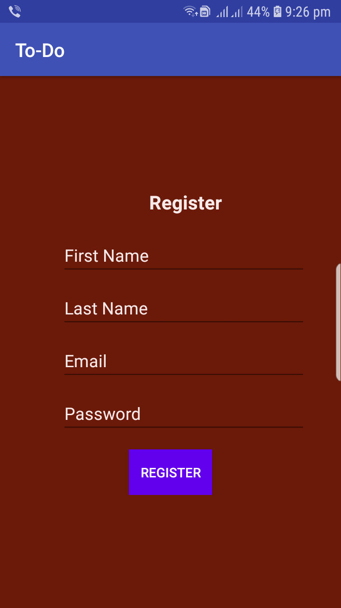
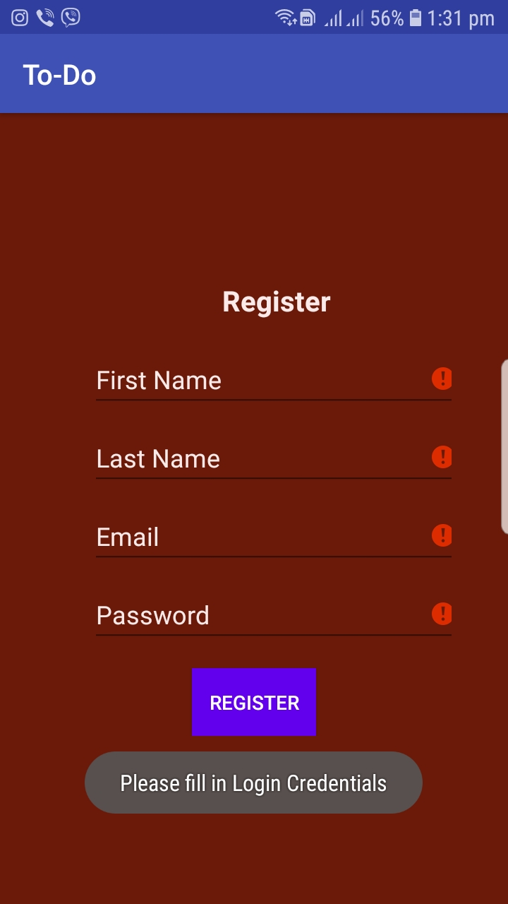
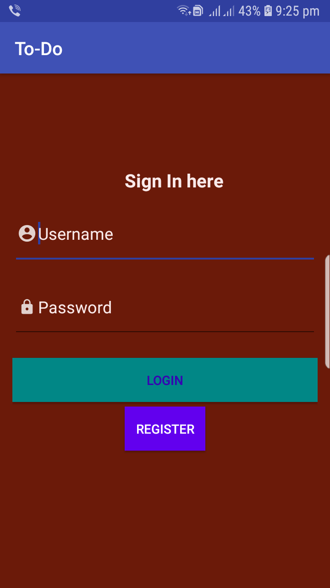
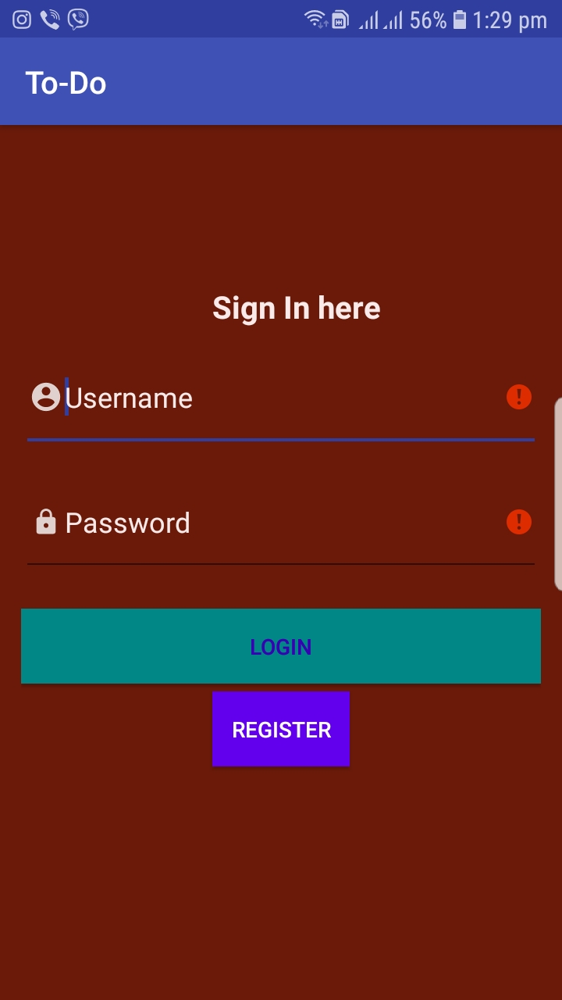
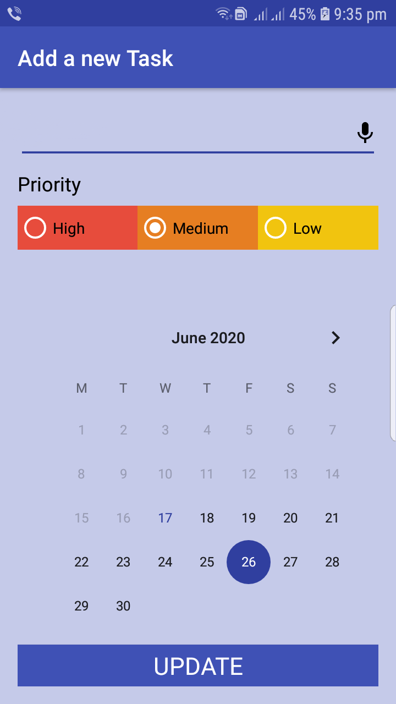
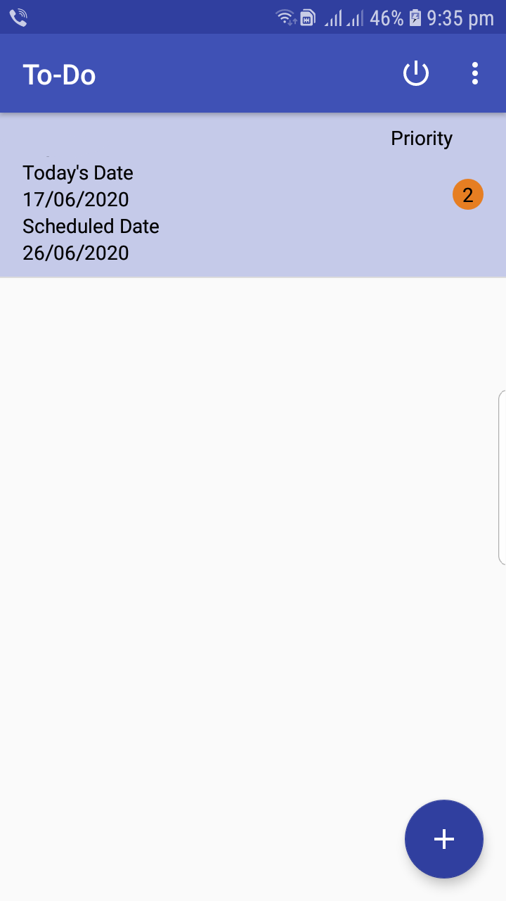
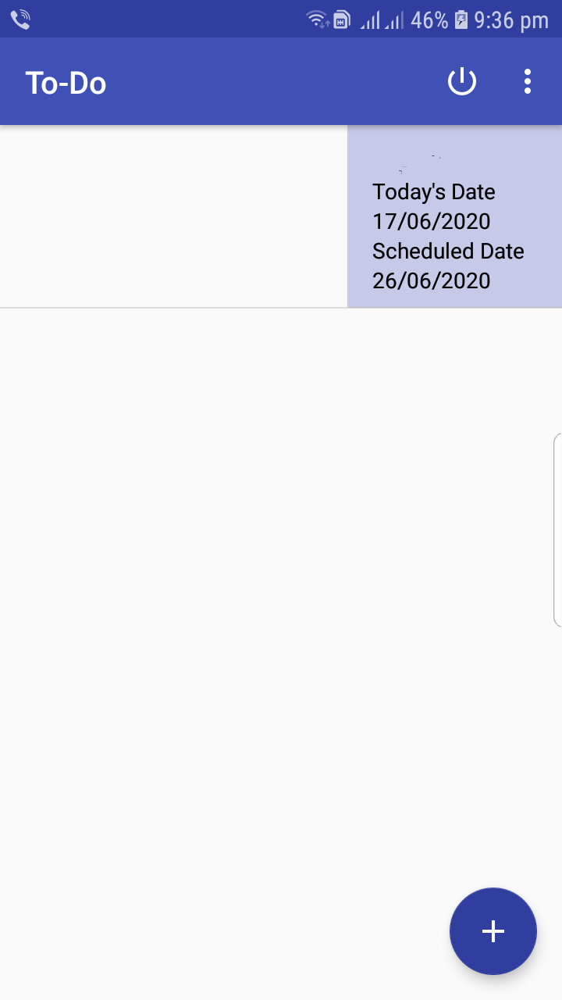

# MADTODO
To-Do app

1. Registration

--Login Validation

2. Login

--Login Validation

3. Logged in..You can add task by clicking the plus sign button

4. You can add task select priority and dates.

5. You can also update the task

6. Task adding 

7. Task can be updated and you can change the date and task 

8. Swipe to delete task

9. You can logout using the logout button

